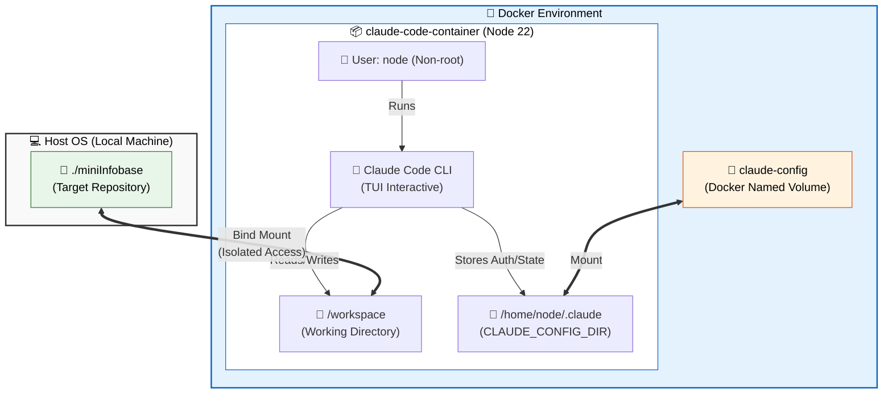

## 🏗️ Development Environment Architecture

이 프로젝트는 호스트 시스템을 안전하게 보호하고 환경을 격리하기 위해 Docker를 사용하여 Claude Code CLI를 실행합니다. Claude는 오직 마운트된 `miniInfobase` 디렉토리에만 접근할 수 있습니다.

 

### 🔒 환경 격리 포인트 (Security & Isolation)

- **제한된 파일 접근 (Directory Isolation):** Claude는 호스트의 전체 파일 시스템에 접근할 수 없으며, 오직 `miniInfobase` 폴더만 `/workspace`로 마운트되어 안전하게 코드를 수정할 수 있습니다.
- **비루트 권한 (Non-root User):** 보안을 위해 Docker 내부에서 `root`가 아닌 `node` 유저 권한으로 실행됩니다.
- **설정 및 인증 분리 (Config Persistence):** Claude의 인증 토큰 및 설정 데이터는 프로젝트 폴더에 노출되지 않고, Docker 내부의 독립적인 볼륨(`claude-config`)에 안전하게 저장 및 유지됩니다.
- **종속성 없는 호스트 (Zero Host Dependency):** 호스트 PC에는 Node.js나 Claude Code를 설치할 필요 없이 Docker만 있으면 즉시 개발 환경이 구성됩니다.
